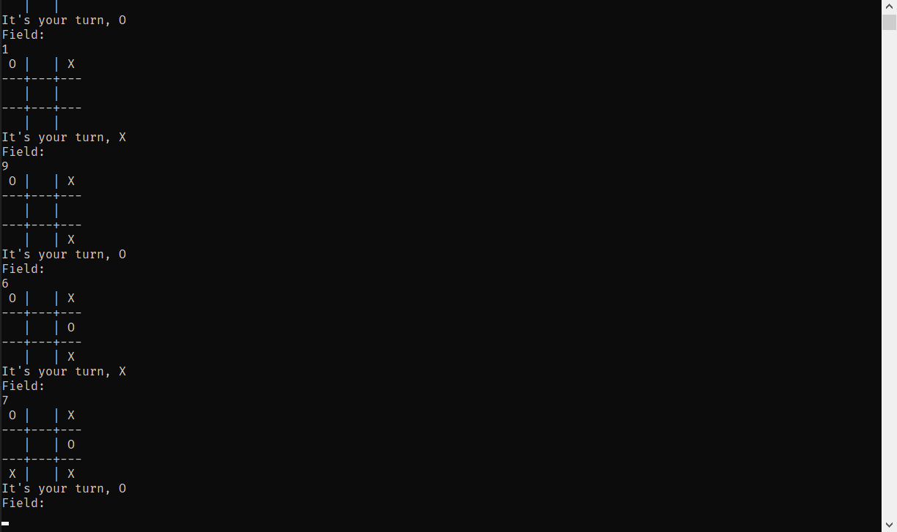

This is a simple Tic Tac Toe game in Haskell.

To play, run the bundled [executable](https://github.com/focccus/haskell_tiktactoe/releases)

The board is stored as a linear list, players can enter field indecies after each other and the board gets displayed.
This program also does validation, checks for win and ties.